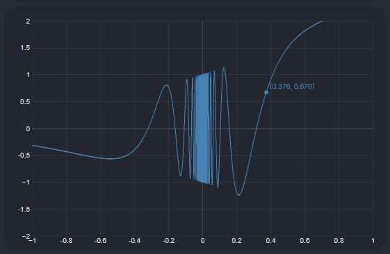

# Obsidian Function Plotter

## Description
A plugin for [Obsidian](https://obsidian.md/) which allows for easy and fast plotting of functions within an Obsidian document. Uses the [function-plot](https://www.npmjs.com/package/function-plot) package to render plots.

## Installing and Using
Install the plugin by downloading the latest version from the releases tab, and extracting into your Obsidian plugins folder (`[vault dir]/.obsidian/plugins/`)

You can include a function plot in one of your notes by using code fences (` ``` `) using the 'plot' language, i.e.
~~~

```plot

```
~~~

Use the options prefix (default `%`, but can be changed to another symbol) to specify options for the graph.

The currently supported options are:
- `%xrange [xmin, xmax]`: Sets the range of x-values to display.
- `%yrange [ymin, ymax]`: Sets the range of y-values to display.
- `%grid`: If provided, will display a background grid in the plot.

On subsequent lines, you can add in any functions you would like to plot. 
Any non-empty line that is not prefixed with a `%` will be treated as a function. 

e.g.
~~~
```plot

%xrange [-1, 1]
%yrange [-2, 2]
%grid

exp(x)*sin(1/x)

```
~~~
Which yields this graph of e^x * sin(x):



These lines are passed directly to [function-plot](https://www.npmjs.com/package/function-plot), which [uses the 'built-in-math-eval' package under the hood](https://github.com/mauriciopoppe/function-plot/issues/184#issuecomment-1041964296). Make sure your function is able to be parsed by this package.

Some minor annoyances you might encounter are:
- Trying to use a constant like 'e' or 'pi' and them not being recognized as constants. Instead, use their decimal values or exp(x) for e^x
- Cryptic error messages when there is an error parsing the function. [function-plot](https://www.npmjs.com/package/function-plot) does not give very descriptive errors, so it can be hard to find out what went wrong.
- Using a variable other than x and having it throw an error. Unfortunately, the only supported variable is x, so expressions involving other commonly used variables (t, r, etc.) are not supported and you will have to rewrite them using x. 
